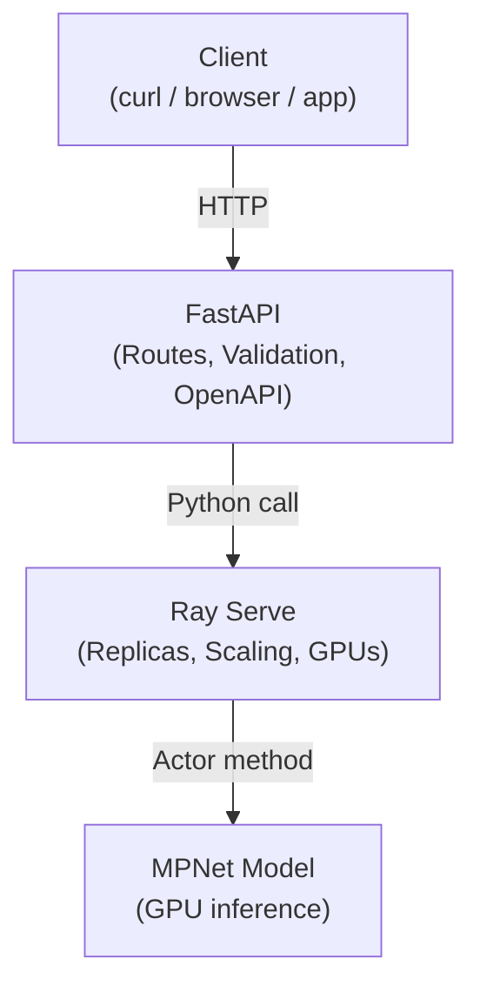

# Zero-Shot

## High-level Architecture

### Diagram (GitHub Mermaid)



###  Instruction

Use a terminal to launch the server:

```python
python python mpnet_zero_shot_serve.py
```

Then use another terminal as a client:

```bash
./zero_shot_client.sh
```

and expect to see 

```
[
  {
    "text": "Customer is asking to refinance their mortgage and lower their monthly payment.",
    "top_labels": [
      {
        "label": "finance",
        "score": 0.32687073945999146
      },
      {
        "label": "customer_support",
        "score": 0.24760405719280243
      }
    ],
    "scores": {
      "finance": 0.32687073945999146,
      "customer_support": 0.24760405719280243,
      "software_engineering": 0.2222762107849121,
      "gpu_debugging": 0.203248992562294
    }
  },
  {
    "text": "GPU kernel is failing due to misaligned memory access.",
    "top_labels": [
      {
        "label": "gpu_debugging",
        "score": 0.3555956184864044
      },
      {
        "label": "customer_support",
        "score": 0.23385828733444214
      }
    ],
    "scores": {
      "finance": 0.20103773474693298,
      "customer_support": 0.23385828733444214,
      "software_engineering": 0.20950840413570404,
      "gpu_debugging": 0.3555956184864044
    }
  }
]
```

in the client terminal which made the `curl` call.